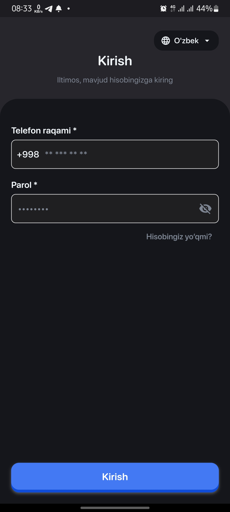
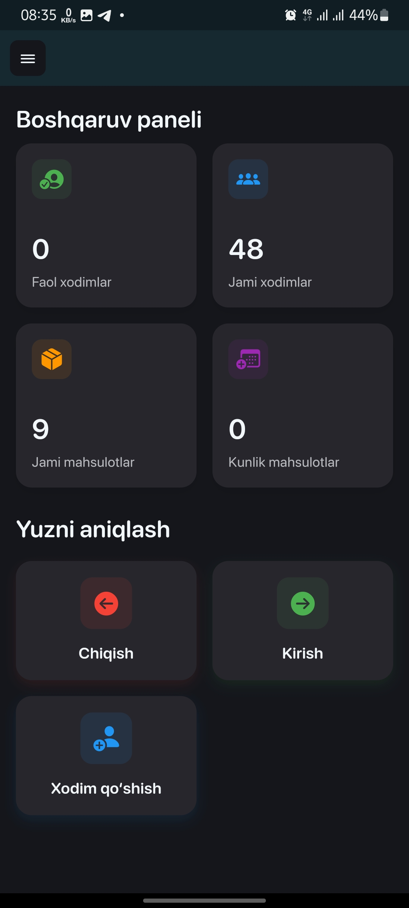
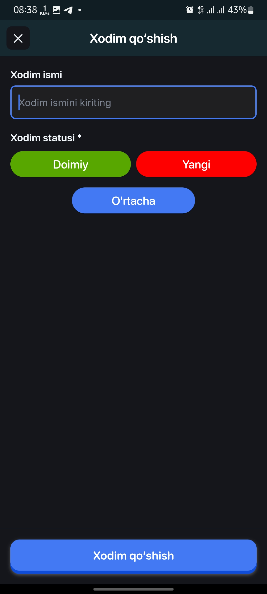
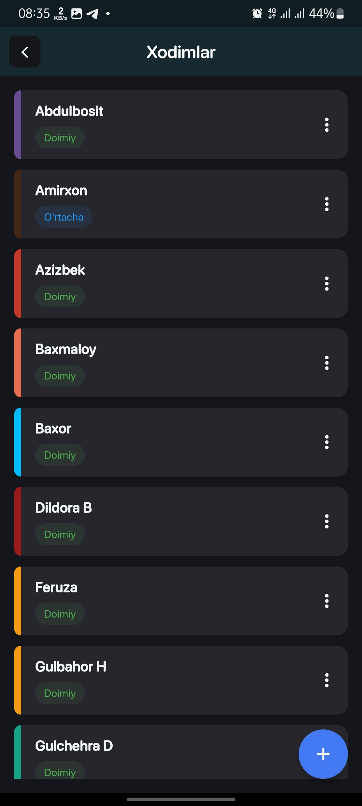
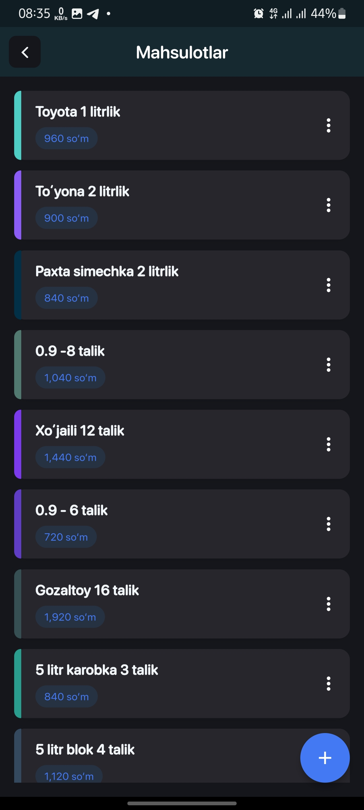
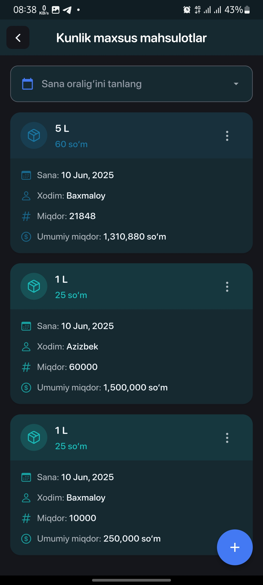
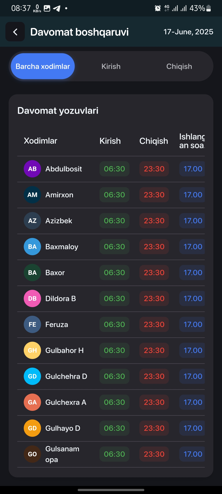
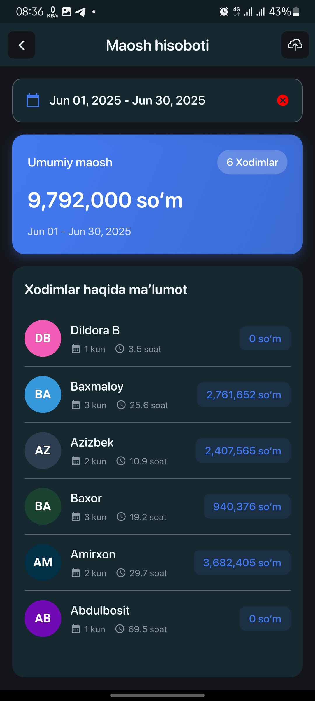
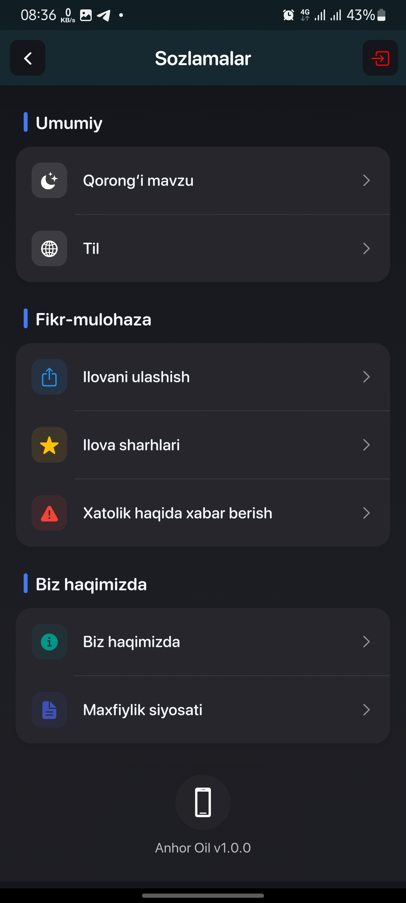

# Anhor Oil ⛽

Welcome to **Anhor Oil** - a comprehensive Flutter-based business management application designed for oil and fuel distribution companies. Built with modern architecture and advanced features, it provides a complete solution for managing daily operations, employee attendance, products, and financial transactions.

---

## 📱 **App Overview**

Anhor Oil is a business management platform that streamlines operations for oil and fuel distribution companies. The application features employee management, attendance tracking, product catalog, sales management, and comprehensive financial reporting. Built with Flutter 3.7.0, it delivers a robust, cross-platform experience with modern UI/UX design.

---

## 📦 **Download**

Download the APK directly:
- [Anhor Oil.apk](./app-release.apk)

**Test Credentials:**
- **Login:** +998777379730
- **Password:** 12345678

---

## 📸 **Screenshots**

<table>
  <tr>
    <td></td>
    <td></td>
    <td></td>
  </tr>
  <tr>
    <td></td>
    <td></td>
    <td></td>
  </tr>
  <tr>
    <td></td>
    <td></td>
    <td></td>
  </tr>
</table>

---

## ⚙️ **Technologies Used**

This project is built with **Flutter 3.7.0** and utilizes modern libraries and technologies:

### Core Technologies:
- **Flutter SDK 3.7.0** - Cross-platform mobile development framework
- **Dart** - Programming language

### State Management & Architecture:
- **flutter_bloc** - Business Logic Component for state management
- **provider** - Simple state management solution
- **get_it** - Service locator for dependency injection
- **get** - Navigation and state management utilities
- **equatable** - Equality comparison for Dart classes
- **dartz** - Functional programming utilities

### Backend & Networking:
- **dio** - Powerful HTTP client for API requests
- **http** - HTTP client for web requests
- **talker_dio_logger** - Network logging and debugging
- **http_parser** - HTTP request/response parsing

### Local Storage & Caching:
- **hive & hive_flutter** - Lightweight key-value database
- **shared_preferences** - Local data persistence
- **cached_network_image** - Image caching solution
- **path_provider** - File system paths

### UI & Animations:
- **lottie** - Vector animations for enhanced user experience
- **animations** - Advanced animation widgets
- **flutter_staggered_animations** - Staggered animations
- **flutter_screenutil** - Screen adaptation for responsive design
- **awesome_bottom_bar** - Custom bottom navigation
- **dotted_border** - Custom border designs
- **shimmer** - Loading placeholder animations
- **carousel_slider** - Image carousel component
- **smooth_page_indicator** - Page indicators
- **draggable_home** - Draggable home screen

### Data Visualization & Tables:
- **syncfusion_flutter_datepicker** - Advanced date picker
- **data_table_2** - Enhanced data tables
- **infinite_scroll_pagination** - Infinite scrolling lists

### Media & File Handling:
- **image_picker** - Camera and gallery integration
- **flutter_image_compress** - Image compression
- **camera** - Camera functionality
- **open_filex** - File opening utilities

### Financial & Currency:
- **money_formatter** - Currency formatting
- **currency_text_input_formatter** - Currency input formatting

### Utilities & Features:
- **device_info_plus** - Device information
- **permission_handler** - Runtime permissions
- **share_plus** - Social sharing functionality
- **url_launcher** - External URL handling
- **flutter_keyboard_visibility** - Keyboard state detection
- **pull_to_refresh** - Pull-to-refresh functionality
- **flutter_typeahead** - Search suggestions
- **popover** - Popover dialogs
- **fluttertoast** - Toast notifications
- **logger** - Logging utility
- **intl** - Internationalization
- **flutter_svg** - SVG image support

---

## 🏗️ **Project Structure**

The project follows a clean architecture pattern with feature-based organization:

```
lib/
├── config/                    # App configuration
│   ├── theme/                # Theme configuration
│   ├── app_dependency.dart   # Dependency injection setup
│   ├── app_routes.dart       # Navigation routes
│   ├── app_translation.dart  # Localization
│   └── request/              # API request configurations
├── core/                     # Core utilities and shared components
│   ├── animations/           # Custom animations
│   ├── constants/            # App constants
│   ├── extensions/           # Dart extensions
│   ├── helpers/              # Helper functions
│   ├── network/              # Network layer
│   ├── preferences/          # SharedPreferences wrapper
│   ├── providers/            # Global providers
│   ├── resources/            # Resource management
│   ├── style/                # App styling
│   ├── usecase/              # Use cases
│   ├── utils/                # Utility functions
│   └── widgets/              # Reusable widgets
├── features/                 # Feature-based modules
│   ├── main/                 # Main feature module
│   ├── attendance/           # Employee attendance management
│   ├── auth/                 # Authentication
│   ├── cleaning/             # Cleaning services management
│   ├── daily_bonus/          # Daily bonus system
│   ├── daily_product/        # Daily product management
│   ├── daily_special_product/ # Special products
│   ├── employee/             # Employee management
│   ├── payments/             # Payment processing
│   ├── products/             # Product catalog
│   ├── salary/               # Salary management
│   └── special_products/     # Special product features
└── main.dart                 # App entry point
```

---

## 🚀 **Key Features**

### 👥 **Employee Management**
- Employee registration and profile management
- Attendance tracking with GPS location
- Performance monitoring and evaluation
- Salary calculation and management

### 📊 **Business Operations**
- Product catalog with pricing
- Daily sales tracking
- Special product promotions
- Inventory management

### 💰 **Financial Management**
- Payment processing and tracking
- Daily bonus system
- Salary calculations
- Comprehensive financial reporting

### 📱 **Mobile Features**
- Camera integration for documentation
- File sharing and export

### 🎨 **User Experience**
- Modern, intuitive interface
- Responsive design for all screen sizes
- Smooth animations and transitions
- Dark/Light theme support
- Multi-language support

---

## 🔧 **Technical Specifications**

- **Flutter Version:** 3.7.0
- **Minimum SDK:** Android API 21+ / iOS 11+
- **Language:** Dart 100%
- **Architecture:** Clean Architecture with BLoC pattern
- **Build Tool:** Flutter SDK with Gradle

---

## 🧪 **Testing**

To test the application, use these credentials:
- **Phone:** +998777379730
- **Password:** 12345678

---

## 📄 **License**

This project is licensed under the MIT License - see the [LICENSE](LICENSE) file for details.

---

## 📞 **Contact & Support**

For any questions, suggestions, or support, feel free to reach out:

- 📱 **Phone:** +998 77 737 97 30
- 📧 **Email:** abdulbasitmakhsudov@gmail.com

---

## 🙏 **Acknowledgments**

- Flutter team for the amazing framework
- The open-source community for the excellent packages
- Oil and fuel industry professionals for domain insights

---

**Developed with ❤️ for Abdulbasit Makhsudov**